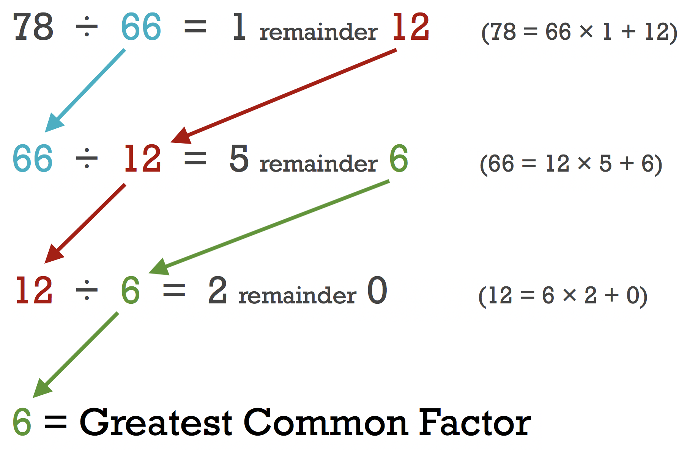
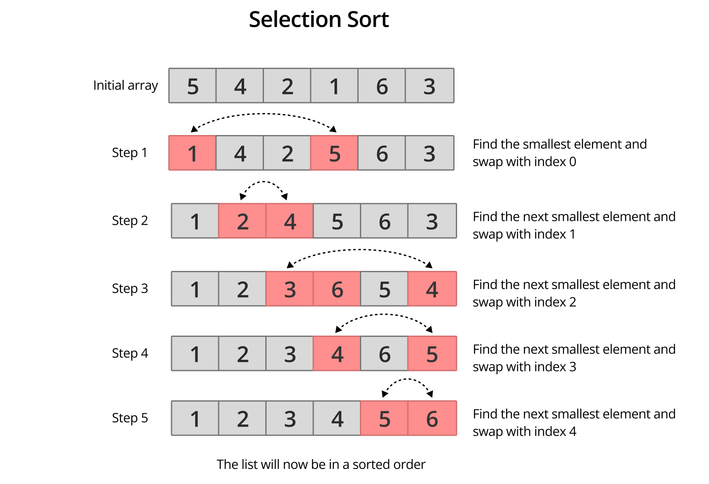
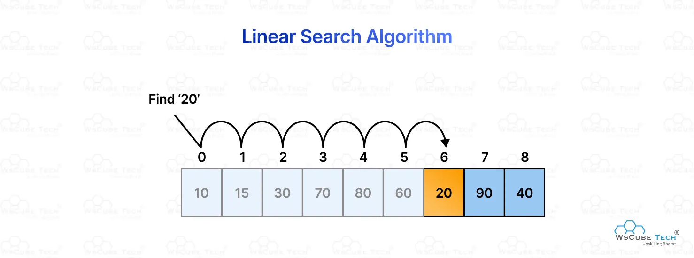
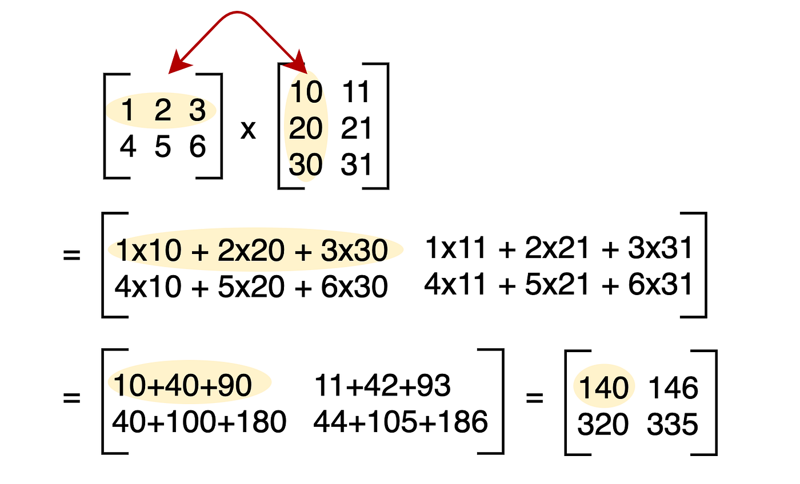
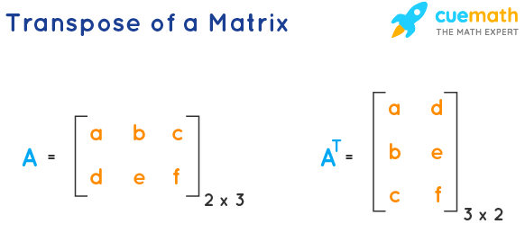
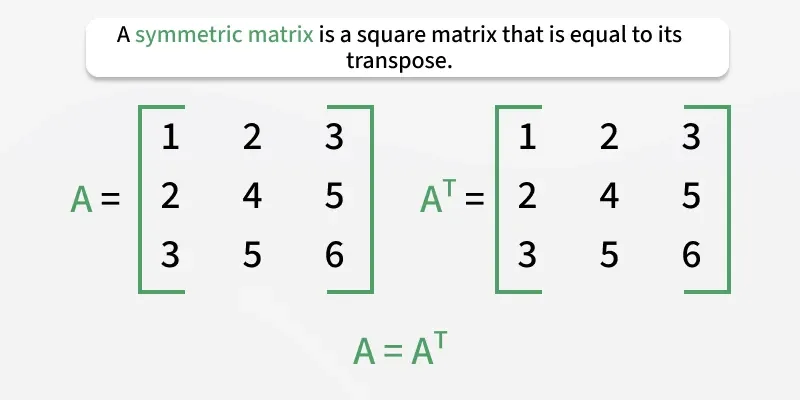
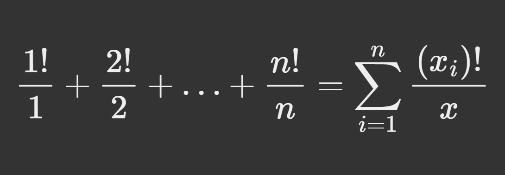
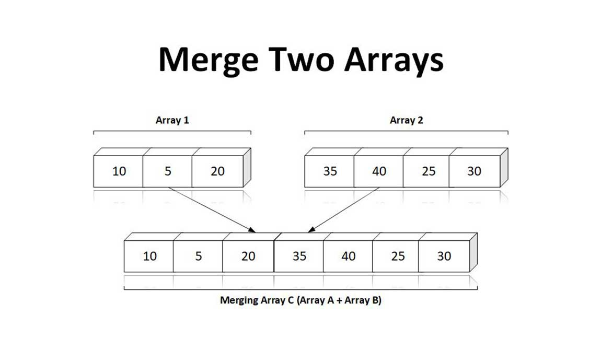

# Sea Of C
C programming assignments and lab work completed as part of my undergraduate coursework at Sister Nivedita University. 
Can't figure out how to run the code? Have a look at [Setup](#setup).

---

## 🧾 Questions
Below are all the questions arranged based on their semester and topic.

| Semester | Question List | Topic Wise Question List |
| - | - | - |
| 1| [Question List](#question-list-semester-i)|  [Topic Wise List](#topic-wise-questions-list-semester-i)  |
| 2| [Question List](#question-list-semester-ii)| [Topic Wise List](#topic-wise-questions-list-semester-ii)  |

### Semester I
The problems which were covered in Semester I.

### Question List (Semester I)

|      | Title                                    | Description 
|   -  | -                                        |:---:
| 1.   | Hello World                              | [View](#1-hello-world-in-c) 
| 2.   | Arithmetic Operations                    | [View](#2-arithmetic-operations-in-c) 
| 3.   | Swap Variables                           | [View](#3-swap-variables) 
| 4.   | Rectangle                                | [View](#4-rectangle) 
| 5.   | Circle                                   | [View](#5-circle) 
| 6.   | Variables                                | [View](#6-variables) 
| 7.   | Operators in C                           | [View](#7-operators-in-c) 
| 8.   | Collinear Points                         | [View](#8-collinear-points) 
| 9.   | Sign Detector                            | [View](#9-sign-detector) 
| 10   | Odd/Even                                 | [View](#10-oddeven) 
| 11.  | Maximum between 2 numbers                | [View](#11-maximum-between-2-numbers) 
| 12.  | Maximum between 3 numbers                | [View](#12-maximum-between-3-numbers) 
| 13.  | Divisibility check for 3 and 5           | [View](#13-3-5-divisibility-test) 
| 14.  | Rectangle Area vs Perimeter Check        | [View](#14-rectangle-area-vs-perimeter-check) 
| 15.  | 3 Digit Number                           | [View](#15-3-digit-number) 
| 16.  | Valid Triangle Sides                     | [View](#16-valid-triangle-sides) 
| 17.  | Valid Triangle Angles                    | [View](#17-valid-triangle-angles) 
| 18.  | Age Category                             | [View](#18-age-category) 
| 19.  | Discount Calculator                      | [View](#19-discount-calculator) 
| 20.  | Salary Calculator                        | [View](#20-salary-calculator) 
| 21.  | Grade Division Calculator                | [View](#21-grade-division-calculator) 
| 22.  | Character Checker                        | [View](#22-character-checker) 
| 23.  | Vowel Consonant Checker                  | [View](#23-vowel-consonant-checker) 
| 24.  | Leap Year Checker                        | [View](#24-leap-year-checker) 
| 25.  | Simple Calculator                        | [View](#25-simple-calculator) 
| 26.  | Simple Grade Calculator                  | [View](#26-simple-grade-calculator) 
| 27.  | Electricity Bill Calculator              | [View](#27-simple-electricity-bill-calculator)
| 28.  | Force Calculation                        | [View](#28-force-calculation)
| 29.  | Distance Calculation                     | [View](#29-distance-calculation)
| 30.  | Final Velocity Calculation               | [View](#30-final-velocity-calculation)
| 31.  | Days Convertor                           | [View](#31-days-convertor)
| 32.  | Seconds Convertor                        | [View](#32-seconds-convertor)
| 33.  | Time Adder                               | [View](#33-time-adder)
| 34.  | Distance Adder                           | [View](#34-distance-adder)
| 35.  | Day Of Week                              | [View](#35-day-of-week)
| 36.  | Month Name                               | [View](#36-month-name)
| 37.  | Vowel Consonant Checker (Switch Case)    | [View](#37-vowel-consonant-checker-switch-case)
| 38.  | Display Numbers                          | [View](#38-display-number)
| 39.  | Shape Area Calculator                    | [View](#39-shape-area-calculator)
| 40.  | Temperature Convertor                    | [View](#40-temperature-convertor)
| 41.  | Odd/Even (Switch Case)                   | [View](#41-odd-even-switch-case) 
| 42.  | Leap Year Checker (Switch Case)          | [View](#42-leap-year-checker-switch-case) 
| 43.  | Currency Convertor                       | [View](#43-currency-convertor) 
| 44.  | Marks Viewer                             | [View](#44-marks-viewer) 
| 45.  | Traffic Light System                     | [View](#45-traffic-light-system) 
| 46.  | Customer Electric Bill Calculator        | [View](#46-customer-electric-bill-calculator) 
| 47.  | Sum of numbers up to n                   | [View](#47-sum-of-numbers-up-to-n) 
| 48.  | Sum of even numbers up to n              | [View](#48-sum-of-even-numbers-up-to-n) 
| 49.  | Sum of Digits                            | [View](#49-sum-of-digits)
| 50.  | Reverse Digits                           | [View](#50-reverse-digits)
| 51.  | Palindrome Number                        | [View](#51-palindrome-number)
| 52.  | Factorial of a number                    | [View](#52-factorial-of-a-number)
| 53.  | Fibonacci Sequence                       | [View](#53-fibonacci-sequence)
| 54.  | Parking Fee Calculator                   | [View](#54-parking-fee-calculator)
| 55.  | Currency Note Calculator                 | [View](#55-currency-note-calculator)
| 56.  | ArmStrong Number                         | [View](#56-armstrong-number)
| 57.  | Perfect Number                           | [View](#57-perfect-number)
| 58.  | Greatest Common Divisor                  | [View](#58-greatest-common-divisor)
| 59.  | Star (*) Triangle                        | [View](#59-star--triangle)
| 60.  | Alphabet Triangle - I                    | [View](#60-alphabet-triangle-i)
| 61.  | Alphabet Triangle - II                   | [View](#61-alphabet-triangle-ii)
| 62.  | Array Initialization                     | [View](#62-array-initialization)
| 63.  | Array Element Sum                        | [View](#63-array-element-sum)
| 64.  | Largest Array Element                    | [View](#64-largest-array-element)
| 65.  | Smallest Array Element                   | [View](#65-smallest-array-element)
| 66.  | Selection Sort                           | [View](#66-selection-sort)
| 67.  | Linear Search                            | [View](#67-linear-search)
| 68.  | 2D Array Initialization                  | [View](#68-2d-array-initialization)
| 69.  | Prime Number                             | [View](#69-prime-number)
| 70.  | Matrix Addition                          | [View](#70-matrix-addition)
| 71.  | Matrix Multiplication                    | [View](#71-matrix-multiplication)
| 72.  | Matrix Transpose                         | [View](#72-matrix-transpose) |
| 73.  | Symmetric Matrix                         | [View](#73-symmetric-matrix) |
| 74.  | Diagonal Elements Sum                    | [View](#74-diagonal-element-sum) |
| 75.  | 2nd Largest Array Element                | [View](#75-2nd-largest-number) |
| 76.  | Odd Even Element Frequency               | [View](#76-odd-even-element-frequency) |
| 77.  | Maximum Function                         | [View](#77-maximum-function) |
| 78.  | Arithmetic Functions                     | [View](#78-arithmetic-functions) |
| 79.  | Factorial Series                         | [View](#79-factorial-series) |
| 80.  | Palindrome Checker                       | [View](#80-palindrome-checker) |
| 81.  | Reverse Array                            | [View](#81-reverse-array) |
| 82.  | Merge Array                              | [View](#82-merge-arrays) |
| 83.  | Insert Element                           | [View](#83-insert-element) |
| 84.  | Frequency of Elements                    | [View](#84-frequency-of-elements) |
| 85.  | Armstrong Checker                        | [View](#85-armstrong-checker) |
| 86.  | Prime Checker                            | [View](#86-prime-checker) |
| 87.  | GCD LCM Finder                           | [View](#87-gcd-lcm-finder) |
| 88.  | Area Perimeter Finder                    | [View](#88-area-perimeter-finder) |
| 89.  | Fibonacci Generator                      | [View](#89-fibonacci-generator) |
| 90.  | Leap Year Checker (Function)             | [View](#90-leap-year-checker) |

### Topic wise Questions List (Semester I)

### Basic Programs
| No. | Title | Description |
| :-: | -- | :--: |
| 1. | Hello World | [View](#1-hello-world-in-c) |
| 2. | Arithmetic Operations | [View](#2-arithmetic-operations-in-c) |
| 3. | Swap Variables | [View](#3-swap-variables) |
| 6. | Variables | [View](#6-variables) |
| 7. | Operators in C | [View](#7-operators-in-c) |

### Simple Programs
| No. | Title                           |              Description              |
| :-: | ------------------------------  | :-----------------------------------: |
|  9.  | Sign Detector                  |        [View](#9-sign-detector)       |
|  10. | Odd/Even                       |          [View](#10-oddeven)          |
|  11. | Maximum between 2 numbers      | [View](#11-maximum-between-2-numbers) |
|  12. | Maximum between 3 numbers      | [View](#12-maximum-between-3-numbers) |
|  13. | Divisibility check for 3 and 5 |   [View](#13-3-5-divisibility-test)   |
|  15. | 3 Digit Number                 |       [View](#15-3-digit-number)      |
|  24. | Leap Year Checker              |     [View](#24-leap-year-checker)     |
|  69. | Prime Number                   |       [View](#69-prime-number)       |
|  55. | Currency Note Calculator       |  [View](#55-currency-note-calculator) |

### Simple Maths Programs
| No. | Title                              |                  Description                  |
| :-: | ---------------------------------  | :-------------------------------------------: |
|  4. | Rectangle                          |              [View](#4-rectangle)             |
|  5. | Circle                             |               [View](#5-circle)               |
|  8. | Collinear Points                   |          [View](#8-collinear-points)          |
|  14. | Rectangle Area vs Perimeter Check | [View](#14-rectangle-area-vs-perimeter-check) |
|  16. | Valid Triangle Sides              |        [View](#16-valid-triangle-sides)       |
|  17. | Valid Triangle Angles             |       [View](#17-valid-triangle-angles)       |
|  58. | Greatest Common Divisor           |      [View](#58-greatest-common-divisor)      |

### Simple Physics Programs
| No. | Title                       |               Description              |
| :-: | --------------------------  | :------------------------------------: |
|  28. | Force Calculation          |      [View](#28-force-calculation)     |
|  29. | Distance Calculation       |    [View](#29-distance-calculation)    |
|  30. | Final Velocity Calculation | [View](#30-final-velocity-calculation) |

### Date and Time Programs

| No. | Title              |          Description          |
| :-: | -----------------  | :---------------------------: |
|  31. | Days Convertor    |   [View](#31-days-convertor)  |
|  32. | Seconds Convertor | [View](#32-seconds-convertor) |
|  33. | Time Adder        |     [View](#33-time-adder)    |
|  34. | Distance Adder    |   [View](#34-distance-adder)  |

### Basic Conditional
| No. | Title                        |                   Description                  |
| :-: | ---------------------------  | :--------------------------------------------: |
|  18. | Age Category                |            [View](#18-age-category)            |
|  19. | Discount Calculator         |         [View](#19-discount-calculator)        |
|  20. | Salary Calculator           |          [View](#20-salary-calculator)         |
|  21. | Grade Division Calculator   |      [View](#21-grade-division-calculator)     |
|  22. | Character Checker           |          [View](#22-character-checker)         |
|  23. | Vowel Consonant Checker     |       [View](#23-vowel-consonant-checker)      |
|  26. | Simple Grade Calculator     |       [View](#26-simple-grade-calculator)      |
|  27. | Electricity Bill Calculator | [View](#27-simple-electricity-bill-calculator) |
|  54. | Parking Fee Calculator      |       [View](#54-parking-fee-calculator)       |


### Switch Case
| No. | Title | Description   |
| :-: | ------------------------------------- | :---------------------------------------------: |
|  25. | Simple Calculator                     | [View](#25-simple-calculator)          |
|  35. | Day Of Week                           | [View](#35-day-of-week)    |
|  36. | Month Name                            | [View](#36-month-name)    |
|  37. | Vowel Consonant Checker               | [View](#37-vowel-consonant-checker-switch-case) |
|  38. | Display Numbers                       | [View](#38-display-number)           |
|  39. | Shape Area Calculator                 | [View](#39-shape-area-calculator)        |
|  40. | Temperature Convertor                 | [View](#40-temperature-convertor)        |
|  41. | Odd/Even                              | [View](#41-odd-even-switch-case)        |
|  42. | Leap Year Checker                     | [View](#42-leap-year-checker-switch-case)    |
|  43. | Currency Convertor                    | [View](#43-currency-convertor)         |
|  44. | Marks Viewer                          | [View](#44-marks-viewer)            |
|  45. | Traffic Light System                  | [View](#45-traffic-light-system)        |
|  46. | Customer Electric Bill Calculator     | [View](#46-customer-electric-bill-calculator)  |

### Loops
| No. | Title                       |               Description               |
| :-: | --------------------------- | :-------------------------------------: |
|  47. | Sum of numbers up to n      |   [View](#47-sum-of-numbers-up-to-n)   |
|  48. | Sum of even numbers up to n |   [View](#48-sum-of-even-numbers-up-to-n) |
|  49. | Sum of Digits               |   [View](#49-sum-of-digits)        |
|  50. | Reverse Digits              |   [View](#50-reverse-digits)       |
|  51. | Palindrome Number           |   [View](#51-palindrome-number)      |
|  52. | Factorial of a number       |   [View](#52-factorial-of-a-number)    |
|  53. | Fibonacci Sequence          |   [View](#53-fibonacci-sequence)     |
|  56. | ArmStrong Number            |   [View](#56-armstrong-number)      |
|  57. | Perfect Number              |   [View](#57-perfect-number)       |

### Patterns
| No. | Title                   |            Description           |
| :-: | ----------------------  | :------------------------------: |
|  59. | Star Triangle           | [View](#59-star--triangle)    |
|  60. | Alphabet Triangle - I   | [View](#60-alphabet-triangle-i) |
|  61. | Alphabet Triangle - II  | [View](#61-alphabet-triangle-ii) |

### 1D Array
| No. | Title                            |             Description            |
| :-: | ----------------------           | :--------------------------------: |
|  62. | Array Initialization             |  [View](#62-array-initialization)  |
|  63. | Array Element Sum                |  [View](#63-array-element-sum)   |
|  64. | Largest Array Element            |  [View](#64-largest-array-element) |
|  65. | Smallest Array Element           |  [View](#65-smallest-array-element) |
|  66. | Selection Sort                   |  [View](#66-selection-sort)     |
|  67. | Linear Search                    |  [View](#67-linear-search)     |
|  75. | 2nd Largest Array Element        |  [View](#75-2nd-largest-number) |
|  76. | Odd Even Element Frequency       |  [View](#76-odd-even-element-frequency) |
|  81. | Reverse Array                    |  [View](#81-reverse-array) |
|  82. | Merge Array                      |  [View](#82-merge-arrays) |
|  83. | Insert Element                   |  [View](#83-insert-element) |
|  84. | Frequency of Elements            |  [View](#84-frequency-of-elements) |

### 2D Array
| No. | Title                        |             Description             |
| :-: | -----------------------      | :---------------------------------: |
|  68. | 2D Array Initialization      | [View](#68-2d-array-initialization) |
|  70. | Matrix Addition              | [View](#70-matrix-addition) |
|  71. | Matrix Multiplication        | [View](#71-matrix-multiplication) |
|  72. | Matrix Transpose             | [View](#72-matrix-transpose) |
|  73. | Symmetric Matrix             | [View](#73-symmetric-matrix) |
|  74. | Diagonal Elements Sum        | [View](#74-diagonal-element-sum) |

### Functions
| No. | Title                        |             Description             |
| :-: | -----------------------      | :---------------------------------: |
| 77.  | Maximum Function                         | [View](#77-maximum-function) |
| 78.  | Arithmetic Functions                     | [View](#78-arithmetic-functions) |
| 79.  | Factorial Series                         | [View](#79-factorial-series) |
| 80.  | Palindrome Checker                       | [View](#80-palindrome-checker) |
| 85.  | Armstrong Checker                        | [View](#85-armstrong-checker) |
| 86.  | Prime Checker                            | [View](#86-prime-checker) |
| 87.  | GCD LCM Finder                           | [View](#87-gcd-lcm-finder) |
| 88.  | Area Perimeter Finder                    | [View](#88-area-perimeter-finder) |
| 89.  | Fibonacci Generator                      | [View](#89-fibonacci-generator) |
| 90.  | Leap Year Checker                        | [View](#90-leap-year-checker) |

### 1. Hello World in C
WAP in C to display "Hello World!" in the output console!

``Answer`` [hello-world.c](src/sem-1/hello-world.c)

`Output Terminal`
```
Hello World!
```

### 2. Arithmetic Operations in C

WAP in C to display to input 2 integers from the user, and perform the basic arithmetic operations on them.
The operations which are to be performed are : 

- Addition `(+)`
- Subtraction `(-)`
- Multiplication `(*)`
- Division `(/)`
- Remainder `(%)`

``Answer`` [arithmetic-operations.c](src/sem-1/arithmetic-operations.c)

`Output Terminal`
```
=== [INPUT] ===
Enter the value of A : 8
Enter the value of B : 6

=== [OUTPUT] ===
Sum of 8 and 6 is 14
Difference of 8 and 6 is 2
Product of 8 and 6 is 48
Quotient of 8 and 6 is 1.333333
Remainder of 8 and 6 is 2
```

### 3. Swap Variables
WAP in C to take 2 integers as input from the users, then swap their values with and without using a 3rd variable based on the option chosen by the user.

Example : If `A = 4 and B = 5`, after processing they will be `A = 5 and B = 4`

``Answer`` [swap.c](src/sem-1/swap.c)

`Output Terminal`
```
=== [INPUT] === 
Enter the value of A : 5
Enter the value of B : 4

=== [SWAPPING] ===
Enter 1 to swap with 3rd variable, 0 to do it without another variable : 0
Swapping variables without a 3rd variable

=== [OUTPUT] ===
New Value Of A : 4, New Value Of B : 5
```

```
=== [INPUT] ===
Enter the value of A : 6
Enter the value of B : 9

=== [SWAPPING] ===
Enter 1 to swap with 3rd variable, 0 to do it without another variable : 1
Swapping variables using a 3rd variable

=== [OUTPUT] ===
New Value Of A : 9, New Value Of B : 6
```

```
=== [INPUT] === 
Enter the value of A : 42
Enter the value of B : 24

=== [SWAPPING] ===
Enter 1 to swap with 3rd variable, 0 to do it without another variable : 8
Invalid option was chosen, 8
Exiting program early with code 1
```

### 4. Rectangle 
WAP in C to take the dimensions of a rectangle as input from the user and calculate and print the perimeter and area of the rectangle.
```
Perimeter = 2 * (Length + Breadth);
Area = Length * Breadth;
```

``Answer`` [rectangle.c](src/sem-1/rectangle.c)

`Output Terminal`
```
=== [INPUT] ===
Enter the length of the rectangle : 5
Enter the breath of the rectangle : 8 
=== [OUTPUT] ===
Perimeter of the rectangle (2 * (L + B)) : 26.000000
Perimeter of the rectangle (L * B) : 40.000000
```

### 5. Circle 
WAP in C to take the radius of a circle as input from the user and calculate and print the perimeter and area of the circle.
```
Perimeter = 2 * PI * Radius;
Area = PI * Radius * Radius;
```

``Answer`` [circle.c](src/sem-1/circle.c)
> If <math.h>.pow is not available, simply multiply the radius twice

`Output Terminal`
```
=== [INPUT] ===
Enter the radius of the circle : 25.6

=== [OUTPUT] ===
Perimeter of the circle [2*PI*R] : 160.768005
Area of the circle [PI*R*R] : 2057.830566
```

### 6. Variables
WAP in C to input various details about a student and log them in the console once done.
The details which are to be taken as input from the user are : 

- The full name of the student (string (char[]))
- The ID of the student (int)
- Average Marks of the student (float)
- Attendance Percentage of the student (double / long float)
- Grade (char)

``Answer`` [variables.c](src/sem-1/variables.c)

`Output Terminal`
```
=== [INPUT] ===
Enter the name of the student : Yuvraj Bhowmik
Enter the student's ID : 342007
Enter the average marks of the student : 42.069
Enter the attendance percentage of the student : 75
Enter the grade of the student : F

=== [OUTPUT] ===
=== Details of the student ===
Name          : Yuvraj Bhowmik
Student ID    : 342007
Average Marks : 42.07 / 100.00
Attendance    : 75.000000%
Grade         : F
```

### 7. Operators in C
WAP in C to input integers and perform a variety of operations on them including:
- Binary Arithmetic Operations
- Unary Arithmetic Operations
- Relational Operations
- Logical Operations
- Assignment Operations
- Ternary Operations
- Bitwise Operations

`Answer` [operators.c](src/sem-1/operators.c)

`Output Terminal`
```
=== [INPUT] ===
Enter the values you want to perform the operations on : 
Enter the value of A : 5
Enter the value of B : 8

=== [Arithmetic Operations] ===
=== [Binary Arithmetic Operation (Operating on 2 operands)] ===
A (5) + B (8) = 13
A (5) - B (8) = -3
A (5) * B (8) = 40
A (5) / B (8) = 0.6250
A (5) % B (8) = 5

=== [Unary Arithmetic Operation (Operating on 1 operand)] ===
A++ : 5
Value changed to => A : 6
++A : 7
Value changed to => A : 7
--B : 7
Value changed to => B : 7
B-- : 7
Value changed to => B : 6

=== [Relational Operations] ===
A (7) == B (6) (Is A equal to B?) :                         0
A (7) != B (6) (Is A not equal to B?) :                     1
A (7) >  B (6) (Is A greater than B?) :                     1
A (7) >= B (6) (Is A greater than or equal to B?) :         1
A (7) <  B (6) (Is A less than B?) :                        0
A (7) <= B (6) (Is A less than or equal to B?) :            0

=== [Logical Operations] ===
A (0) % 2 == 0 || B (-4) % 2 == 1 (A is even or B is odd) :         0
A (1) % 2 == 0 && B (-4) % 2 == 0 (A is even and B is even) :       0
!(A (7) == B (6)) !(A is equal to B) => (A is not equal to B) :     1

=== [Assignment Operations] ===
Result = a * 10; Result :
B -= 2 => B = 4
A += 10 => A = 17
A *= 2 => A = 34
A /= 10 => A = 3
A = 10 => A = 3

=== [Ternary Operations] ===
Enter the age : 17
The user is a minor!

=== [Bitwise Operations] ===
 A (3) | B (4)  : 7
 A (3) & B (4)  : 0
 A (3) ^ B (4)  : 7
~A (3)           : -4
~B (4)           : -5
 A (3) << 2      : 12
 A (3) >> 2      : 0
 B (4) << 1      : 8
 B (4) >> 1      : 2
```

## Notes

### 🧮 Compound (Shorthand) Assignment Operators

Compound assignment operators like `+=`, `-=`, `*=`, `/=`, and `%=` are used to simplify expressions where a variable is operated on and then reassigned to itself.

Instead of writing :
```c
a = a * 2;
```

You can use : 
```c
a *= 2;
```

> [!NOTE]
These aren't just syntax sugar—compilers handle them as dedicated operations and may generate slightly different (sometimes more efficient) code than the expanded form.


⚠️ Be careful with operand order:
```c
a -= b; 
b -= a;
```
The first means `a = a - b`;
The second means `b = b - a`;

### ❓ Ternary (Conditional) Operator
The ternary operator is a compact way to conditionally assign values. It behaves like an if-else expression and is often used in single-line assignments.

Traditional if-else:

```c
int isOver18;

if (age >= 18)
{
    isOver18 = 1;
}
else
{
    isOver18 = 0;
}
```
Same logic using a ternary operator:


```c
int isOver18 = (age >= 18) ? 1 : 0;
```
```c
<variable> = <condition> ? <value_if_true> : <value_if_false>;
```
If the condition is true, value_if_true is assigned. Otherwise, `value_if_false` is assigned.

> [!NOTE]
While it behaves like an if-else, the ternary operator is not rewritten by the compiler into if-else code. The compiler handles it as an expression and may even optimize it more efficiently in some cases. Use it to write "cleaner" and shorter logic when appropriate.


### 8. Collinear Points
WAP in C to input 3 sets of coordinates and check whether they are collinear or not.
There are several ways you can do this Mathematically, such as considering it points of a triangle and then calculating the area, comparing slopes etc. We will do it by comparing the slope.

If 3 points are collinear then the slope of the 3rd and 2nd point will be equal to the slope of the 2nd and 1st point.


`Answer` [collinearPoints.c](src/sem-1/collinearPoints.c)

`Output Terminal`
```
=== [INPUT] ===
Enter the coordinates of the points...
Point A : 1 1
Point B : 2 2
Point C : 3 3

=== [OUTPUT] ===
Points are collinear
```

```
=== [INPUT] ===
Enter the coordinates of the points...
Point A : 3 5
Point B : 7 10
Point C : 67 68

=== [OUTPUT] ===
Points are non collinear
```

### 9. Sign Detector
WAP in C to input an integer and check whether it is zero, a positive number or a negative number.

`Answer` [signDetector.c](src/sem-1/signDetector.c)

`Output Terminal`
```
=== [INPUT] ===
Enter the number : 25

=== [OUTPUT] ===
Number is a +ve number
```

```
=== [INPUT] ===
Enter the number : -6

=== [OUTPUT] ===
Number is a -ve number
```

```
=== [INPUT] ===
Enter the number : 0

=== [OUTPUT] ===
Number is zero
```

### 10. Odd/Even
WAP in C to input an integer and check whether it is an odd or even number.

`Answer` [oddEven.c](src/sem-1/oddEven.c)

`Output Terminal`
```
=== [INPUT] ===
Enter the number : 3

=== [OUTPUT] ===
Number is an odd number
```

```
=== [INPUT] ===
Enter the number : 4

=== [OUTPUT] ===
Number is an even number
```

### 11. Maximum between 2 numbers
WAP in C to find the maximum between 2 given integers and print the number which is bigger. For example if `A = 2` and `B = 5`, you need to print B which is the bigger number. The value of the number need not be printed. (Edge case : Both the numbers might be equal)

`Answer` [max2Numbers.c](src/sem-1/max2Numbers.c)

`Output Terminal`
```
=== [INPUT] ===
Enter the numbers...
Enter the value of A : 25 
Enter the value of B : 6

=== [OUTPUT] ===
A is greater than B
```

```
=== [INPUT] ===
Enter the numbers...
Enter the value of A : 4
Enter the value of B : 4

=== [OUTPUT] ===
B is equal to A
```

### 12. Maximum between 3 numbers
WAP in C to find the maximum between 3 given integers and print the number which is bigger. For example if `A = 2`, `B = 5`, `C = 6` you need to print C which is the biggest number amongst the three. The value of the number need not be printed. (Edge case : All the numbers might be the same)

`Answer` [max3Numbers.c](src/sem-1/max3Numbers.c)

`Output Terminal`
```
=== [INPUT] ===
Enter the numbers...
Enter the value of A : 2
Enter the value of B : 5
Enter the value of C : 6

=== [OUTPUT] ===
C is the greatest number
```

```
=== [INPUT] ===
Enter the numbers...
Enter the value of A : 3
Enter the value of B : 3
Enter the value of C : 3

=== [OUTPUT] ===
All the numbers are equal
```

### 13. 3, 5 Divisibility Test
WAP in C to enter an integer and check whether it is divisible by 3 or 5. (Edge case : It might be divisible by both or none, for which you might or might not need to add a separate output if asked, which will make it the commonly asked [Fizz Buzz Problem](https://www.geeksforgeeks.org/dsa/fizz-buzz-implementation/))

`Answer` [div3-5.c](src/sem-1/div3-5.c)

`Output Terminal`
```
=== [INPUT] ===
Enter the number : 15

=== [OUTPUT] ===
The number is divisible by 3
The number is divisible by 5
```

```
=== [INPUT] ===
Enter the number : 7

=== [OUTPUT] ===
Divisible by neither 3 nor 5
```

### 14. Rectangle Area vs Perimeter Check
WAP in C to input the dimensions of a rectangle (width and breadth) and check if the area of the rectangle is greater than its perimeter. [Formulas](#4-rectangle) have already been discussed.

`Answer` [rectangle-area-vs-perimeter.c](src/sem-1/rectangle-area-vs-perimeter.c)

`Output Terminal`
```
=== [INPUT] ===
Enter the dimensions of the rectangle...
Enter the width : 3
Enter the breadth : 4

=== [OUTPUT] ===
Perimeter : 14.00
Area : 12.00
Perimeter is greater than the area
```

```
=== [INPUT] ===
Enter the dimensions of the rectangle...
Enter the width : 5
Enter the breadth : 6

=== [OUTPUT] ===
Perimeter : 22.00
Area : 30.00
Area is greater than the perimeter
```

### 15. 3 Digit Number
WAP in C to input an integer and check whether it is a 3 digit number or not

`Answer` [digit3Number](src/sem-1/digit3Number.c)

`Output Terminal`
```
=== [INPUT] ===
Enter the number : 256

=== [OUTPUT] ===
Number is a 3 digit number
```

```
=== [INPUT] ===
Enter the number : 34

=== [OUTPUT] ===
Number is not a 3 digit number
```

### 16. Valid Triangle Sides
WAP in C to input 3 numbers and check whether they can be used to form a valid triangle. The [Triangle Inequality Theorem](https://en.wikipedia.org/wiki/Triangle_inequality) states that 
> The sum of the lengths of any two sides must be greater than or equal to the length of the remaining side.


`Answer` [validTriangleSides.c](src/sem-1/validTriangleSides.c)

`Output Terminal`
```
=== [INPUT] ===
Enter the sides...
Enter the first side : 1
Enter the second side : 1
Enter the third side : 2

=== [OUTPUT] ===
A valid triangle can be formed
```

```
=== [INPUT] ===
Enter the sides...
Enter the first side : 25
Enter the second side : 3
Enter the third side : 2

=== [OUTPUT] ===
A valid triangle can't be formed
```

### 17. Valid Triangle Angles
WAP in C to input 3 numbers and check if those can the angles used to form a triangle. The sum of the angles should be equal to 180.

`Answer` [validTriangleAngles.c](src/sem-1/validTriangleAngles.c)

`Output Terminal`
```
=== [INPUT] ===
Enter the angles...
Angle A : 50
Angle B : 60
Angle C : 70

=== [OUTPUT] ===
A valid triangle can be formed using the angles
```
```
=== [INPUT] ===
Enter the angles...
Angle A : 5
Angle B : 6
Angle C : 7

=== [OUTPUT] ===
A valid triangle can't be formed using the angles
```

### 18. Age Category
WAP in C to input the age of the user and give them their respective category as output.

| Age     | Category 
|   -     |     -
| < 18    | Children 
| 18 - 60 | Young 
| > 60    | Old 


`Answer` [ageCategory.c](src/sem-1/ageCategory.c)

`Output Terminal`
```
=== [OUTPUT] ===
Enter the age : 17

=== [OUTPUT] ===
Category : Children
```
```
=== [OUTPUT] ===
Enter the age : 25

=== [OUTPUT] ===
Category : Young
```
```
=== [OUTPUT] ===
Enter the age : 64

=== [OUTPUT] ===
Category : Old
```

### 19. Discount Calculator
While purchasing certain items, a discount of 10% is offered if the quantity purchased is more than 1000. If quantity and price per item are input through the keyboard. WAP in C to calculate the total expenses.

`Answer` [discountCalculator.c](src/sem-1/discountCal.c)

`Output Terminal`
```
=== [INPUT] ===
Enter the quantity : 1200
Enter the rate : 10

=== [OUTPUT] ===
Total Amount is : 10800.0000
```

```
=== [INPUT] ===
Enter the quantity : 512
Enter the rate : 3 

=== [OUTPUT] ===
Total Amount is : 1536.0000
```

### 20. Salary Calculator
In a company an employee is paid as under: If their basic salary is less than `Rs. 1500`, then `HRA = 10%` of basic salary and `DA = 90%` of basic salary. If their salary is either equal to or above `Rs. 1500`, then `HRA = Rs. 500` and `DA = 98%` of basic salary. WAP in C to input the basic salary of the employee and calculate their gross salary.

`Answer` [salaryCalculator.c](src/sem-1/salaryCalculator.c)

`Output Terminal`
```
=== [INPUT] ===
Enter the base salary : 1200

=== [OUTPUT] ===
Gross Salary : 2400.000
```
```
=== [INPUT] ===
Enter the base salary : 1500

=== [OUTPUT] ===
Gross Salary : 3470.000
```

### 21. Grade Division Calculator
WAP in C to input the marks attained by a student in 5 different subjects and calculate the percentage of marks gained in total. Based on that percentage calculate and display the division attained by the student.

| Percentage   | Division      |
| -            | -             |
| >= 60        | 1st Division  |
| 50 - 59      | 2nd Division  |
| 40 - 49      | 3rd Division  |
| <= 40        | Fail          |

`Answer` [gradeDivisionCalculator](src/sem-1/gradeDivisionCalculator.c)

`Output Terminal`
```
=== [INPUT] ===
Enter the marks obtained in the subjects...
Marks in A : 80
Marks in B : 98
Marks in C : 78
Marks in D : 45
Marks in E : 100

=== [OUTPUT] ===
Percentage obtained : 80.20%
1st Division
```

### 22. Character Checker
WAP in C to input an character and check whether it is the following or not without using any pre-built character check methods.
It might be an upper case alphabet (`A - Z`), lower case (`a - z`) or digit (`0 - 9`) or a special character (`#, @, %, $`, etc)

`Answer` [characterChecker.c](src/sem-1/characterChecker.c)

`Output Terminal`
```
=== [INPUT] ===
Enter the character : A

=== [OUTPUT] ===
Upper Case Character (A - Z)
```
```
=== [INPUT] ===
Enter the character : #

=== [OUTPUT] ===
Special Character : #
```

### 23. Vowel Consonant Checker
WAP in C to input an alphabet and check whether it is a vowel or consonant without using any string functions.

`Answer` [vowelConsonant.c](src/sem-1/vowelConsonant.c)

`Output Terminal`
```
=== [INPUT] ===
Enter the alphabet : 6

=== [OUTPUT] ===
Entered character is not an alphabet
```

```
=== [INPUT] ===
Enter the alphabet : a

=== [OUTPUT] ===
Entered alphabet is a vowel
```

```
=== [INPUT] ===
Enter the alphabet : x

=== [OUTPUT] ===
Entered alphabet is a consonant
```

### 24. Leap Year Checker
WAP in C to input a year and check whether it is a leap year or not. Leap year repeat every `4` years (so we can check if it is divisible by `4`) but there is a small exception where leap year is not celebrated on century years such as `1800`, `1500` unless they are also divisible by `400`. 

> Wanna know why that exception exists? Read more about it [here](https://en.wikipedia.org/wiki/Leap_year#Gregorian%20calendar:~:text=in%20leap%20years.-,Gregorian%20calendar,-%5Bedit%5D)

`Answer` [leapYear.c](src/sem-1/leapYear.c)

`Output Terminal`
```
=== [INPUT] ===
Enter the year : 1600

=== [OUTPUT] ===
Year 1600 is a leap year
```
```
=== [INPUT] ===
Enter the year : 1800

=== [OUTPUT] ===
Year 1800 is not a leap year
```

### 25. Simple Calculator
WAP in C to input 2 operands and a single operand and print out the result.
The program should support the follow operations : `+`, `-`, `*`, `/`, `%`.

`Answer` [simpleCalculator.c](src/sem-1/simpleCalculator.c)

`Output Terminal`
```
=== [INPUT] ===
Enter the operation...
4 * 5

=== [OUTPUT] ===
4.00 * 5.00 = 20.00
```

```
=== [INPUT] ===
Enter the operation...
25 / 6

=== [OUTPUT] ===
25.00 / 6.00 = 4.17
```

### 26. Simple Grade Calculator 
WAP in C to create a simple grade calculator based on the average of the marks in 5 subjects which are to be input by the user.

| Marks        | Grade |
| -            | -     |
| >= 90        | O     |
| 80 - 89      | E     |
| 70 - 79      | A     |
| 60 - 69      | B     |
| 50 - 59      | C     |
| 40 - 49      | D     |
| < 40         | F     |

`Answer` [simpleGradeCalculator.c](src/sem-1/simpleGradeCalculator.c)

`Output Terminal`
```
=== [INPUT] ===
Enter the marks : 65

=== [OUTPUT] ===
Grade Attained : B
```

### 27. Simple Electricity Bill Calculator
WAP in C to enter the number of units used and calculate the total price based on the slabs.
For the first `102` units the price per unit is `4.89` for the next `58` units the price is `5.40` and for units any higher each unit will be priced at `6.50`

`Answer` [electricityBill.c](src/sem-1/electricityBill.c)

`Output Terminal`
```
=== [INPUT] ===
Enter the number of units : 180

=== [OUTPUT] ===
The total cost for is : 941.980
```

### 28. Force Calculation
WAP in C to calculate the force after taking `mass (kg)` and `acceleration (m/s^2)` as input from the user. Use the formula : `Force  = Mass * Acceleration`.

`Answer` [forceCal.c](src/sem-1/forceCal.c)

`Output Terminal`
```
=== [INPUT] ===
Enter the mass of the body : 500
Enter the acceleration of the body : 10

=== [OUTPUT] ===
Mass : 500.00 kg(s)
Acceleration : 10.00 m/s^2
Force : 5000.00 N
```

### 29. Distance Calculation
WAP in C to enter the `distance traveled (d)` after taking the `initial velocity (u) m/s`, `acceleration (f) m/s^2` and `time (t) s` as input from the user. Use the second equation of motion : `d = ut + 1/2ft^2`.

`Answer` [distanceCal.c](src/sem-1/distanceCal.c)

`Output Terminal`
```
=== [INPUT] ===
Enter the initial velocity (u) : 25
Enter the acceleration (f) : 6
Enter the time (t) : 16

=== [OUTPUT] ===
Distance Traveled : 1168.00 m
```

### 30. Final Velocity Calculation
WAP in C to calculate the `final velocity (v)` after taking the `initial velocity (u) m/s`, `acceleration (a) m/s^2` and `displacement (d)` as input from the user. Use the third equation of motion : `v^2 = u^2 + 2ad`, `v = sqrt(u^2 + 2ad)`

`Answer` [finalVelCal.c](src/sem-1/finalVelCal.c)

`Output Terminal`
```
=== [INPUT] ===
Enter the initial velocity (u) :
5 
Enter the acceleration (f) : 2
Enter the distance traveled (t) : 8

=== [OUTPUT] ===
Final Velocity : 7.55 m/s
```

### 31. Days Convertor 
WAP in C to convert days into years, months, weeks, and days.
Hint : `Years = Days / 365`, `Months = Remaining Days / 30`, `Weeks = Remaining Days / 7`,`Days = Remaining Days`. Putting in the values for the remaining days we get : 
```
Years = Days / 365
Months = (Days % 365) / 30
Weeks = ((Days % 365) % 30) / 7
Days = ((Days % 365) % 30) % 7
```
`Answer` [daysConvertor.c](src/sem-1/daysConvertor.c)

`Output Terminal`
```
=== [INPUT] ===
Enter the number of days : 768

=== [OUTPUT] ===
768 days = 2 year(s) 1 month(s) 1 week(s) 1 day(s)
```

### 32. Seconds Convertor 
WAP in C to convert seconds into hours, minutes, and seconds.
Hint : `Hours = Seconds / 3600`, `Minutes = Remaining Seconds / 60`, `Seconds = Remaining Seconds`. Putting in the values for the remaining seconds we get : 
```
Hours = Seconds / 3600
Minutes = (Seconds % 3600) / 60
Seconds = (Seconds % 3600) % 60
```
`Answer` [secondsConvertor.c](src/sem-1/secondsConvertor.c)

`Output Terminal`
```
=== [INPUT] ===
Enter the number of seconds : 6400

=== [OUTPUT] ===
6400 seconds = 1 hours(s) 46 minutes(s) and 40 seconds(s)
```

### 33. Time Adder 
Write a program in C to add two times taken in hours, minutes, and second format `T1 = {hour1, minute1, second1}`, `T2 = {hour2, minute2, second2}` and add them up and display the output in this format : `T3 = {hour3, minute3, second3}`. 

The Maths behind the solution is quite simple, we simply need to add the corresponding values from `T1` and `T2` and if they are more than what they could be then they are to be converted (`Seconds if more than 60 get converted into Minutes and similarly minutes when larger than 60 get converted into hours`)
```
Seconds = (T1_Seconds + T2_Seconds) % 60
Minutes = (T1_Minutes + T2_Minutes) % 60 + (T1_Seconds + T2_Seconds) / 60
Hours = (T1_Hours + T2_Hours) + (T1_Minutes + T2_Minutes) / 60 + (T1_Seconds + T2_Seconds) / 60
```


`Answer` [timeAdder.c](src/sem-1/timeAdder.c)

`Output Terminal`
```
=== [INPUT] ===
Enter T1 : 
Hour : 5
Minute : 40
Second : 5

Enter T2 : 
Hour : 2
Minute : 56
Second : 4

=== [OUTPUT] ===
T3 = 8 hour(s) 36 minute(s) 9 second(s)
```

### 34. Distance Adder 
Write a program in C to add two distances taken in feet and inches, format `D1 = {feet1, inch1}`, `D2 = {feet2, inch2}` and add them up and display the output in this format : `D3 = {feet3, inch3}`. 

The Maths behind the solution is once again quite simple, (It is similar to the previous) we simply need to add the corresponding values from `D1` and `D2` and if they are more than what they could be then they are to be converted (`Inches if more than 12 get converted into feet`)

```
Inches = (D1_Inches + D2_Inches) % 12
Feet = (D1_Feet + D2_Feet) + ((D1_Inches + D2_Inches) / 12)
```

`Answer` [distanceAdder.c](src/sem-1/distanceAdder.c)

`Output Terminal`
```
=== [INPUT] ===
Enter D1 :
Feet : 5
Inch : 11

Enter D2 :
Feet : 5
Inch : 4

=== [OUTPUT] ===
D3 = 11 feet 3 inch(es)
```

### 35. Day Of Week
WAP in C to find the day of the week using switch-case.

`Answer` [dayOfWeek.c](src/sem-1/dayOfWeek.c)

`Output Terminal`
```
=== [INPUT] ===
Enter the day : 3

=== [OUTPUT] ===
The corresponding day is : Tuesday
```

```
=== [INPUT] ===
Enter the day : 8

=== [OUTPUT] ===
The corresponding day is : INVALID, No day was found at 8
```

### 36. Month Name
WAP in C to find the month name using switch-case.

`Answer` [monthName.c](src/sem-1/monthName.c)

`Output Terminal`
```
=== [INPUT] ===
Enter the month : 1

=== [OUTPUT] ===
The corresponding month is : January
```

```
=== [INPUT] ===
Enter the month : 13

=== [OUTPUT] ===
The corresponding month is : INVALID, No month was found at 13
```

### 37. Vowel Consonant Checker (Switch Case)
WAP in C to check whether a character is a vowel or consonant using switch-case.

`Answer` [vowelConsonantSwitchCase.c](src/sem-1/vowelConsonantSwitchCase.c)

`Output Terminal`
```
=== [INPUT] ===
Enter the character : y

=== [OUTPUT] ===
y is a consonant
```

```
=== [INPUT] ===
Enter the character : O

=== [OUTPUT] ===
O is a vowel
```

```
=== [INPUT] ===
Enter the character : 6

=== [OUTPUT] ===
6 is not an alphabet, Can't be a vowel or consonant
```

### 38. Display Number
WAP in C to display numbers (0–9) in words using switch-case.

`Answer` [displayNumber.c](src/sem-1/displayNumber.c)

`Output Terminal`
```
=== [INPUT] ===
Enter the number : 7

=== [OUTPUT] ===
Number Name : Seven
```

```
=== [INPUT] ===
Enter the number : 89

=== [OUTPUT] ===
Number Name : [INVALID OPTION], Can't name 89
```

### 39. Shape Area Calculator
WAP in C to calculate the area of any given shape (add at least 3 shapes the user can choose from).

> [!NOTE] 
I have added Square (a^2), Circle (PI * r^2) and Triangle (1/2 * b * h).

`Answer` [shapeAreaCalculator.c](src/sem-1/shapeAreaCalculator.c)

`Output Terminal`
```
=== [INPUT] ===
Choose the shape for which you want to calculator the area :
- 0 <=> Square
- 1 <=> Circle
- 2 <=> Triangle
Select Shape : 2

=== [OUTPUT] ===
Triangle has been selected
Enter the base of the triangle : 2
Enter the height of the triangle : 2
```

```
=== [INPUT] ===
Choose the shape for which you want to calculator the area :
- 0 <=> Square
- 1 <=> Circle
- 2 <=> Triangle
Select Shape : 7

=== [OUTPUT] ===
The shape for option 7 is not supported
```

### 40. Temperature Convertor
WAP in C to convert temperature (Celsius ↔ Fahrenheit) using switch case.
You can use the following relations for the conversion
```
F = (C * 9/5) + 32
C = (F - 32) * 5/9

where C = Temperature in Celsius Scale
      F = Temperature in Fahrenheit Scale
```

`Answer` [temperatureConvertor.c](src/sem-1/temperatureConvertor.c)

`Output Terminal`
```
=== [INPUT] ===
Enter the temperature : 32
Enter 0 to convert to Fahrenheit and 1 to convert to Celsius : 0

=== [OUTPUT] ===
Temperature in Fahrenheit : 89.60
```

```
=== [INPUT] ===
Enter the temperature : 98
Enter 0 to convert to Fahrenheit and 1 to convert to Celsius : 1

=== [OUTPUT] ===
Temperature in Celsius : 36.67
```

### 41. Odd Even Switch Case
WAP in C to check whether a number is even, odd, or zero using switch case.

`Answer` [oddEvenSwitchCase.c](src/sem-1/oddEvenSwitchCase.c)

`Output Terminal`
```
=== [INPUT] ===
Enter the number : 0

=== [OUTPUT] ===
The number is zero
```

```
=== [INPUT] ===
Enter the number : 6

=== [OUTPUT] ===
The number is non-zero
The number is even
```

```
=== [INPUT] ===
Enter the number : 5

=== [OUTPUT] ===
The number is non-zero
The number is odd
```

### 42. Leap Year Checker Switch Case
WAP in C to check whether a year is a leap year using switch-case. You can read about the rules of leap years [here](#24-leap-year-checker) (normal leap year question).

`Answer` [leapYearSwitchCase.c](src/sem-1/leapYearSwitchCase.c)

`Output Terminal`
```
=== [INPUT] ===
Enter the year : 1800

=== [OUTPUT] ===
Year 1800 is a century year
Year 1800 is a not leap year
```

```
=== [INPUT] ===
Enter the year : 1600

=== [OUTPUT] ===
Year 1600 is a century year
Year 1600 is a leap year
```

```
=== [INPUT] ===
Enter the year : 2024

=== [OUTPUT] ===
Year 2024 is not a century year
Year 2024 is a leap year
```

### 43. Currency Convertor
WAP in C to convert currency (USD ↔ INR, EUR ↔ INR) using switch case.

`Answer` [currencyConvertor.c](src/sem-1/currencyConvertor.c)

`Output Terminal`
```
=== [INPUT] ===
--- Select the initial currency ---
0 -> USD
1 -> EUR
2 -> INR
Choice : 2
Enter the amount : 50

=== [OUTPUT] ===
--- Enter the target currency ---
0 -> USD
1 -> EUR
Choice : 1

50.00 INR = 0.57 EUR
```

```
=== [INPUT] ===
--- Select the initial currency ---
0 -> USD
1 -> EUR
2 -> INR
Choice : 0
Enter the amount : 50

=== [OUTPUT] ===
50.00 USD = 4370.00 INR
```

### 44. Marks Viewer  
WAP in C to display student result (Total, Average, Pass/Fail) using switch case. After inputting marks in 3 subjects.

`Answer` [marksViewer.c](src/sem-1/marksViewer.c)

`Output Terminal`
```
=== [INPUT] ===
--- Enter the marks ---
Marks in A : 50
Marks in B : 70
Marks in C : 40

--- Select option ---
- 0 -> Total Marks
- 1 -> Average Marks
- 2 -> Pass/Fail Status
Option : 2

=== [OUTPUT] ===
Status : Pass
```

```
=== [INPUT] ===
--- Enter the marks ---
Marks in A : 50
Marks in B : 90
Marks in C : 40

--- Select option ---
- 0 -> Total Marks
- 1 -> Average Marks
- 2 -> Pass/Fail Status
Option : 1

=== [OUTPUT] ===
Average Marks : 60.00
```

### 45. Traffic Light System
WAP in C to simulate a traffic light system using switch case.

`Answer` [trafficLightSystem.c](src/sem-1/trafficLightSystem.c)

`Output Terminal`
```
=== [INPUT] ===
--- Select the light ---
- 0 => Red
- 1 => Yellow
- 2 => Green
Choice : 1

=== [OUTPUT] ===
Traffic Light was switched to Yellow -- Please SLOW DOWN
```

### 46. Customer Electric Bill Calculator
WAP in C to calculate electricity bill for different customer categories using switch case. Input the number of units and the category and display the bill amount.

| Category           | Price Per Unit |
|-                   |:---:           |
| Residential        | ₹10            |
| Commercial         | ₹8             |
| Industry           | ₹20            |

`Answer` [customerElectricBillCalculator.c](src/sem-1/customerElectricBillCal.c)

`Output Terminal`
```
=== [INPUT] ===
Enter the number of units : 50

--- Select the category ---
- 0 -> Residential
- 1 -> Commercial
- 2 -> Industrial
Choice : 2

=== [OUTPUT] ===
Bill Amount : 1000
```

```
=== [INPUT] ===
Enter the number of units : 50

--- Select the category ---
- 0 -> Residential
- 1 -> Commercial
- 2 -> Industrial
Choice : 8

=== [OUTPUT] ===
Selected category '8' wasn't found
Residential Rates will be used
Bill Amount : 500
```

### 47. Sum of numbers up to n
WAP in C to input a number `n` and use any type of loop to find the sum of all +ve integers up to `n` and print it out as the output.

`Answer` [sumUptoN.c](src/sem-1/sumUptoN.c)

`Output Terminal`
```
=== [INPUT] ===
Enter n : 5

=== [OUTPUT] ===
Sum of integers up to 5 : 10
```

### 48. Sum of even numbers up to n
WAP in C to input a number `n` and use any type of loop to find the sum of all +ve even integers up to `n` and print it out as the output.

`Answer` [evenSumUptoN.c](src/sem-1/evenSumUptoN.c)

`Output Terminal`
```
=== [INPUT] ===
Enter n : 5

=== [OUTPUT] ===
Sum of even integers up to 5 : 6
```

### 49. Sum of Digits
WAP in C to input a number `n` and use any type of loop to find the sum of all its digits print it out as the output.

`Answer` [sumOfDigits.c](src/sem-1/sumOfDigits.c)

`Output Terminal`
```
=== [INPUT] ===
Enter n : 256

=== [OUTPUT] ===
Sum of digits of 256 : 13
```

### 50. Reverse Digits
WAP in C to input a number `n` and use any type of loop to find reverse the number by reversing the order of its digits and print the reversed number as output.

`Answer` [reverseDigits.c](src/sem-1/reverseDigits.c)

`Output Terminal`
```
=== [INPUT] ===
Enter n : 256

=== [OUTPUT] ===
Reverse of 256 <=> 652
```

### 51. Palindrome Number
WAP in C to input a number `n` and check whether it is palindrome number or not. A palindrome number is one which reads the same from the front and back. So its reverse and itself are the same number. Example : `121 = 121`, where as `52 != 25`

`Answer` [palindromeNumber.c](src/sem-1/palindromeNumber.c)

`Output Terminal`
```
=== [INPUT] ===
Enter n : 55

=== [OUTPUT] ===
Reverse of 55 <=> 55, thus 55 is a palindrome
```

```
=== [INPUT] ===
Enter n : 256

=== [OUTPUT] ===
Reverse of 256 <=> 652, thus 256 is not a palindrome
```

### 52. Factorial of a number
WAP in C to input a number `n` and find and print its factorial (`n!`). 
```
Where, 
n! = n * (n-1)!, and 1! = 1

Example : 
(3)! = 3! * 2!
     = 3! * 2 * 1!
     = 3! * 2 * 1
```

`Answer` [factorial.c](src/sem-1/factorial.c)

`Output Terminal`
```
=== [INPUT] ===
Enter n : 5

=== [OUTPUT] ===
5! = 120
```

```
=== [INPUT] ===
Enter n : -8
-ve numbers are not supported!
```

### 53. Fibonacci Sequence
WAP in C to input a number `n` and print the first n elements of the Fibonacci Sequence.
The Fibonacci Sequence starts with `0` and `1` and then every consecutive element is found by adding the previous 2 elements.

```
So 
0, 1, 0 + 1 => 0, 1, 2
0, 1, 2, 1 + 2 => 0, 1, 2, 3
...
...
0, 1, 2, 3, 5, 8, 13...
```

`Answer` [fibonacci.c](src/sem-1/fibonacci.c)

`Output Terminal`
```
=== [INPUT] ===
Enter n : 25

=== [OUTPUT] ===
Sequence : 0 1 1 2 3 5 8 13 21 34 55 89 144 233 377 610 987 1597 2584 4181 6765 10946 17711 28657 46368
```

```
=== [INPUT] ===
Enter n : -5
Invalid number of elements!
```

### 54. Parking Fee Calculator
WAP in C to input parking hours and calculate the total fee based on hourly rates.
Use if for special rates like “first hour free”, “flat rate after 10 hours", "flat rates after 24 hours".

`Answer` [parkingFeeCalculator.c](src/sem-1/parkingFeeCalculator.c)

`Output Terminal`
```
=== [INPUT] ===
Enter the number of hours parked : 45

=== [OUTPUT] ===
Price for 45 hour(s) of parking : 2000.00
```

```
=== [INPUT] ===
Enter the number of hours parked : 1

=== [OUTPUT] ===
Price for 1 hour(s) of parking : 0.00
```

### 55. Currency Note Calculator
WAP in C to input an amount and calculate minimum number of notes
(500, 200, 100, 50, 10, coins etc) So for example : `1544` will require `3 x 500`, `4 x 10` notes and `4 x 1 coins`.

`Answer` [currencyNoteCalculator.c](src/sem-1/currencyNoteCalculator.c)

`Output Terminal`
```
=== [INPUT] ===
Enter the amount : 2563

=== [OUTPUT] ===
500 x 5 = 2500
200 x 0 = 0
100 x 0 = 0
50  x 1 = 50
10  x 1 = 10
1   x 3 = 3
```

```
=== [INPUT] ===
Enter the amount : 512

=== [OUTPUT] ===
500 x 1 = 500
200 x 0 = 0
100 x 0 = 0
50  x 0 = 0
10  x 1 = 10
1   x 2 = 2
```

### 56. ArmStrong Number
WAP in C to input a number and check if it is an armstrong number or not.
A number is said to be an armstrong number if the sum of its digits raised to the power of the number of digits is equal to the number itself.

For example : 
```
153 has 3 digits
1^3 + 5^3 + 3^3 = 153
Thus 153 is an armstrong number
```

`Answer` [armStrong.c](src/sem-1/armStrong.c)

`Output Terminal`
```
=== [INPUT] ===
Enter the number : 153

=== [OUTPUT] ===
153 is an armstrong number
```

```
=== [INPUT] ===
Enter the number : 96

=== [OUTPUT] ===
96 is not an armstrong number
```

### 57. Perfect Number
WAP in C to input a number and check whether it is a perfect number or not.
A perfect number is a number which is equal to the sum of all its proper divisors (Of course excluding the number itself).

For example : 
```
6 is a perfect number as 1, 2, 3 are 6's proper divisors (excluding 6) 
and 1 + 2 + 3 = 6
```

`Answer` [perfectNumber.c](src/sem-1/perfectNumber.c)

`Output Terminal`
```
=== [INPUT] ===
Enter the number : 6

=== [OUTPUT] ===
6 is a perfect number
```

```
=== [INPUT] ===
Enter the number : 5

=== [OUTPUT] ===
5 is not a perfect number
```

### 58. Greatest Common Divisor
WAP in C to input 2 numbers `(a, b)` and calculate their G.C.D. (Greatest Common Denominator), then use that G.C.D. to calculate its L.C.M. (Least Common Multiple) using the relation - `LCM(a, b) * GCD(a, b) = a * b`.<br>

To calculate the G.C.D. one can use [Euclidean Algorithm](https://en.wikipedia.org/wiki/Euclidean_algorithm) which is an efficient method developed by ancient Greek mathematician Euclid. The algorithm works by repeatedly applying the division algorithm, where the larger number is replaced by the remainder of the division until the remainder becomes zero. The last non-zero remainder is the GCD of the original two numbers. 



`Answer` [gcd.c](src/sem-1/gcd.c)

`Output Terminal`
```
=== [INPUT] ===
Enter A : 78
Enter B : 66

=== [OUTPUT] ===
GCD(78, 66) = 6
LCM(78, 66) = 858
```

```
=== [INPUT] ===
Enter A : 15
Enter B : 45

=== [OUTPUT] ===
GCD(15, 45) = 15
LCM(15, 45) = 45
```

### 59. Star (*) Triangle
WAP in C to create a triangle like this : 
```
*
* *
* * *
* * * *
* * * * *

Here n is 5
```
Your program should input `n` which describes the number of rows and you should print a triangle made with `*`. 

`Answer` [starTriangle.c](src/sem-1/starTriangle.c)

`Output Terminal`
```
=== [INPUT] ===
Enter the number of rows (n) : +5

=== [OUTPUT] ===
* 
* * 
* * * 
* * * * 
* * * * *
```

```
=== [INPUT] ===
Enter the number of rows (n) : 3

=== [OUTPUT] ===
*
* *
* * *
```

### 60. Alphabet Triangle I
WAP in C to create a triangle like this : 
```
A
B B
C C C
D D D D
E E E E E
F F F F F F

Here n is 6
```
Your program should input `n` which describes the number of rows and you should print a triangle made with the alphabets. You can assume `(n <= 26) So it never goes past Z` 

`Answer` [alphabetTriangleI.c](src/sem-1/alphabetTriangleI.c)

`Output Terminal`
```
=== [INPUT] ===
Enter the number of rows (n) : 6

=== [OUTPUT] ===
A
B B
C C C
D D D D
E E E E E
F F F F F F
```

```
=== [INPUT] ===
Enter the number of rows (n) : 3

=== [OUTPUT] ===
A 
B B 
C C C 
```

### 61. Alphabet Triangle II
WAP in C to create a triangle like this : 
```
A
B C
D E F
G H I J
K L M N O
P Q R S T U

Here n is 6
```
Your program should input `n` which describes the number of rows and you should print a triangle made with the alphabets. You can assume `(n <= 6) So it never goes past Z` 

`Answer` [alphabetTriangleII.c](src/sem-1/alphabetTriangleII.c)

`Output Terminal`
```
=== [INPUT] ===
Enter the number of rows (n) : 6

=== [OUTPUT] ===
A
B C
D E F
G H I J
K L M N O
P Q R S T U
```

```
=== [INPUT] ===
Enter the number of rows (n) : 3

=== [OUTPUT] ===
A
B C
D E F
```

### 62. Array Initialization
WAP in C to input a number `length` and create an array of length `length`, enter elements into that array and then display it however you want (each element on a new line, all on the same line, etc).

```
Example : n = 3

Element at 0 : 1
Element at 1 : 2
Element at 2 : 3

Array : [1, 2, 3]
```
`Answer` [arrayInit.c](src/sem-1/arrayInit.c)

> [!NOTE]
One can use directly print each element on a new line if they want to avoid the `[` and `,` logic.

`Output Terminal`
```
=== [INPUT] ===
Enter the length : 3

---Enter the elements---
Element at 0 : 1
Element at 1 : 2
Element at 2 : 3

=== [OUTPUT] ===
Array : [1,2,3]
```

```
=== [INPUT] ===
Enter the length : 5

---Enter the elements---
Element at 0 : 4
Element at 1 : 9
Element at 2 : 7
Element at 3 : 6
Element at 4 : 2

=== [OUTPUT] ===
Array : [4,9,7,6,2]
```

### 63. Array Element Sum
WAP in C to input a number `length` and create an array of length `length`, enter elements into that array and then find the sum of all its elements and print it.

`Answer` [arrayElementSum.c](src/sem-1/arrayElementSum.c)

`Output Terminal`
```
=== [INPUT] ===
Enter the length : 5

---Enter the elements---
Element at 0 : 7
Element at 1 : 9
Element at 2 : 6
Element at 3 : 4
Element at 4 : 1

=== [OUTPUT] ===
Sum of elements : 27
```
```
=== [INPUT] ===
Enter the length : 3

---Enter the elements---
Element at 0 : 2  
Element at 1 : 5
Element at 2 : 6

=== [OUTPUT] ===
Sum of elements : 13
```

### 64. Largest Array Element
WAP in C to input a number `length` and create an array of length `length`, enter elements into that array and then find the largest element in that array. Assume that the elements are all positive (So the smallest can be 0 and the largest can be infinity).

> [!NOTE]
So we can assume the maximum to be 0 and then compare this maximum with every element of the array. If the element is larger than the previous maximum then we set maximum equal to this element and continue till the end.

> [!NOTE]
If all sorts of values are allowed, then the default value of max must be INT_MIN and not 0. For which one must use the `limit.h` file. We use this header in the next question.

`Answer` [largestArrayElement.c](src/sem-1/largestArrayElement.c)

`Output Terminal`
```
=== [INPUT] ===
Enter the length : 3

---Enter the elements---
Element at 0 : 256
Element at 1 : 8795
Element at 2 : 512   

=== [OUTPUT] ===
Largest element : 8795
```

### 65. Smallest Array Element
WAP in C to input a number `length` and create an array of length `length`, enter elements into that array and then find the smallest element in that array.

> [!NOTE]
So we can assume the minimum to be `INT_MAX` and then compare this minimum with every element of the array. If the element is smaller than the previous minimum then we set minimum equal to this element and continue till the end.

> [!NOTE]
If one knows the upper limit of the values of the elements then they can use that value as the default value for minimum instead of `INT_MAX`.

`Answer` [smallestArrayElement.c](src/sem-1/smallestArrayElement.c)

`Output Terminal`
```
=== [INPUT] ===
Enter the length : 3

---Enter the elements---
Element at 0 : 256
Element at 1 : 8795 
Element at 2 : 512

=== [OUTPUT] ===
Smallest element : 256
```

### 66. Selection Sort
WAP in C to input a number `length` and create an array of length `length`, enter elements into that array and then sort the array in ascending order using selection sort. Then display the sorted array in any form you want along with the smallest and largest values.

`Selection Sort` is a simple, in-place comparison based sorting algorithm. It works by repeatedly finding the minimum element from the unsorted part of the array and placing it at the beginning of the unsorted part.



> [!NOTE]
Once the array is sorted in ascending order, the first element will be the smallest while the last element will be the largest.

`Answer` [selectionSort.c](src/sem-1/selectionSort.c)

`Output Terminal`
```
=== [INPUT] ===
Enter the length : 3

---Enter the elements---
Element at 0 : 753
Element at 1 : 159
Element at 2 : 789 

=== [OUTPUT] ===
Initial Array : [753, 159, 789]
Sorted Array : [159, 753, 789]
Min Element : 159
Max Element : 789
```

### 67. Linear Search 
WAP in C to input a number `length` and create an array of length `length`, enter elements into that array and then enter another value `n` and search for `n` in the array using linear search. If it was found then print the index at which it was found.

`Linear Search` also known as sequential search, is a straightforward algorithm used to find a specific element within a list or array. It operates by examining each element in the collection one by one, in sequence, until the desired element is found or the entire list has been traversed. 



`Answer` [linearSearch.c](src/sem-1/linearSearch.c)

`Output Terminal`
```
=== [INPUT] ===
Enter the length : 4

---Enter the elements---
Element at 0 : 1
Element at 1 : 5
Element at 2 : 8
Element at 3 : 9
Enter the element which is to be searched : 5

=== [OUTPUT] ===
'5' was found at 1
```

```
=== [INPUT] ===
Enter the length : 4

---Enter the elements---
Element at 0 : 1
Element at 1 : 5
Element at 2 : 8
Element at 3 : 9
Enter the element which is to be searched : 3

=== [OUTPUT] ===
'3' was not found
```

### 68. 2D Array Initialization
WAP in C to declare a 2D array of order `n * m` where `n` is the number of rows and `m` is the number of columns. Take input for the elements and store it in the array and then display it as a matrix.

`Answer` [2D-arrayInit.c](src/sem-1/2D-arrayInit.c)

`Output Terminal`
```
=== [INPUT] ===
---Enter order of the array---
Enter the number of rows : 3
Enter the number of columns : 3

---Enter elements of the array---
Element at 0, 0 : 1
Element at 0, 1 : 2
Element at 0, 2 : 3
Element at 1, 0 : 4
Element at 1, 1 : 5
Element at 1, 2 : 6
Element at 2, 0 : 7
Element at 2, 1 : 8
Element at 2, 2 : 9

=== [OUTPUT] ===
1 2 3 
4 5 6 
7 8 9
```

### 69. Prime Number
WAP in C to input a number `n` from the user and check whether it is prime or composite.
A number is a prime number if it is a `+ve` number more than 1 `(n > 1)` and has only 2 factors, them being `1` and the number itself `(n)`.<br />

1 itself is considered to be neither prime nor composite as it only has one factor that being itself. And `-ve` numbers are considered to be neither prime nor composite as they are not `+ve` which goes against the definition of a prime number.

> [!NOTE]
We can solve this in various ways, but most of them work on the principle of simply counting the number of factors the number has. So we can start a loop from 1 till `n` and count the numbers which are `n`'s factors. To optimize it we can optimize it further by running the loop from `2` to `n/2` or even better to `sqrt(n)` as if any other number in that range is a factor of `n` that directly means `n` is composite.

`Answer` [primeChecker.c](src/sem-1/primeChecker.c)

`Output Terminal`
```
=== [INPUT] ===
Enter the number : 3

=== [OUTPUT] ===
3 is prime
```

```
=== [INPUT] ===
Enter the number : 25

=== [OUTPUT] ===
25 is composite
```

### 70. Matrix Addition
WAP in C to input 2 matrices of the same order `n` * `m` and then add them up then print the output matrix in the console. 

> [!NOTE]
> Matrix addition works by adding each element of the first element with each element of the second matrix. This is why the order of the matrices need to be the same in order to be added together.
> 

`Answer` [matrixSum.c](src/sem-1/matrixSum.c)

> [!NOTE]
> This answer has repetitive blocks of code for input for matrix, if one has covered functions it will be recommended to turn those in functions to make the code cleaner and the logic clearer.

`Output Terminal`
```
=== [INPUT] ===
Enter the row count (n): 2
Enter the column count (m): 2

Enter elements for array A: 
- Enter element at (0, 0): 1
- Enter element at (0, 1): 2
- Enter element at (1, 0): 3
- Enter element at (1, 1): 4

Enter elements for array B: 
- Enter element at (0, 0): 1
- Enter element at (0, 1): 2
- Enter element at (1, 0): 3
- Enter element at (1, 1): 4

=== [OUTPUT] ===
Output Matrix:
2 4
6 8
```
### 71. Matrix Multiplication
WAP in C to enter 2 matrices of order `n1` * `m1` and `n2` * `m2` and multiply them to form a matrix of order `n1` * `m2` and print the output matrix.

> [!NOTE]
> To find an element in the resulting matrix, you multiply the corresponding elements of a row from the first matrix and a column from the second matrix, then add the products together.  
> The requirement for matrix multiplication is that the number of columns of the first matrix should be equal to the number of rows of the second matrix. 
> The output matrix has the order equal to the row count of the 1st matrix and the column count of the 2nd matrix.
> 

`Answer` [matrixMultiplication.c](src/sem-1/arrayMultiplication.c)

`Output Terminal`
```
=== [INPUT] ===
---ARRAY A---
Enter the row count (n): 2
Enter the column count (m): 3

---ARRAY B---
Enter the row count (n): 3
Enter the column count (m): 2

Enter elements for array A: 
- Enter element at (0, 0): 1
- Enter element at (0, 1): 2
- Enter element at (0, 2): 3
- Enter element at (1, 0): 4
- Enter element at (1, 1): 5
- Enter element at (1, 2): 6

Enter elements for array B:
- Enter element at (0, 0): 10
- Enter element at (0, 1): 11
- Enter element at (1, 0): 20
- Enter element at (1, 1): 21
- Enter element at (2, 0): 30
- Enter element at (2, 1): 31

=== [OUTPUT] ===
Output Matrix:
140 146
320 335
```

### 72. Matrix Transpose
WAP in C to enter a matrix of order `n` * `m` and find its transpose of order `m` * `n` and print it to the console.



`Answer` [matrixTranspose.c](src/sem-1/matrixTranspose.c)

`Output Terminal`
```
=== [INPUT] ===
Enter the row count (n): 2
Enter the column count (m): 3

Enter elements for array: 
- Enter element at (0, 0): 1
- Enter element at (0, 1): 2
- Enter element at (0, 2): 3
- Enter element at (1, 0): 4
- Enter element at (1, 1): 5
- Enter element at (1, 2): 6

=== [OUTPUT] ===
Original Matrix:
1 2 3
4 5 6

Transpose Matrix:
1 4
2 5
3 6
```

### 73. Symmetric Matrix
WAP in C to input a `n` * `m` matrix and check whether it is symmetric or not. A matrix is called a symmetric matrix if for all values of `i` and `j`, `a[i][j]` is equal to the value at `a[j][i]`, thus the transpose of the matrix is equal to the original matrix.



`Answer` [symmetric-matrix.c](src/sem-1/symmetric-matrix.c)

> [!NOTE]
> Here it is implemented using a simple check, one can first find the transpose and then compare the matrices.

`Output Terminal`
```
=== [INPUT] ===
Enter the row count (n): 3
Enter the column count (m): 3

---Enter the elements of the array---
-Enter element at (0, 0): 1
-Enter element at (0, 1): 2
-Enter element at (0, 2): 3
-Enter element at (1, 0): 2
-Enter element at (1, 1): 4
-Enter element at (1, 2): 5
-Enter element at (2, 0): 3
-Enter element at (2, 1): 5
-Enter element at (2, 2): 6

=== [OUTPUT] ===
The matrix is symmetric
```

### 74. Diagonal Element Sum
WAP in C to enter a matrix of order `n` * `m`and print all the elements of the primary diagonal and their sum.

> [!NOTE]
> Primary diagonal elements has a simple property where their column and row indices are the same. (`i = j`)
> 


`Answer` [diagonal-elements-matrix.c](src/sem-1/diagonal-elements-matrix.c)

`Output Terminal`
```
=== [INPUT] ===
Enter the row count (n): 3
Enter the column count (m): 3

---Enter the elements of the array---
-Enter element at (0, 0): 1
-Enter element at (0, 1): 2
-Enter element at (0, 2): 3
-Enter element at (1, 0): 4
-Enter element at (1, 1): 5
-Enter element at (1, 2): 6
-Enter element at (2, 0): 7
-Enter element at (2, 1): 8
-Enter element at (2, 2): 9

=== [OUTPUT] ===
Diagonal Elements: {1, 5, 9}
Sum of diagonal elements: 15
```

### 75. 2nd Largest Number
WAP in C to enter an array of length `n` and find the 2nd largest number in the array and print it to the console.

`Answer` [2ndLargestNumber.c](src/sem-1/2ndLargestNumber.c)

`Output Terminal`
```
=== [INPUT] ===
Enter length (n): 5
---Enter elements---
Enter element at (0): 54
Enter element at (1): 23
Enter element at (2): 342
Enter element at (3): 6
Enter element at (4): 46

=== [OUTPUT] ===
Second Largest Element: 54
```

### 76. Odd Even Element Frequency
WAP in C to enter an array of length `n` and find the frequency (number of) odd and even elements.

`Answer` [oddEvenElementFreq.c](src/sem-1/oddEvenElementFreq.c)

`Output Terminal`
```
=== [INPUT] ===
Enter length (n): 5
---Enter elements---
Enter element at (0): 1
Enter element at (1): 2
Enter element at (2): 3
Enter element at (3): 4
Enter element at (4): 5

=== [OUTPUT] ===
Even Element Frequency: 2
Odd  Element Frequency: 3
```

### 77. Maximum Function
WAP in C to find the maximum between two numbers using functions.

`Answer` [maximumFunc.c](src/sem-1/maximumFunc.c)

`Output Terminal`
```
=== [INPUT] ===
Enter the value of A: 5
Enter the value of B: 6

=== [OUTPUT] ===
Maximum: 6
```

### 78. Arithmetic Functions
WAP in C to input 2 numbers and perform the arithmetic operations using functions — addition, subtraction, multiplication, and division — on two given numbers. The program should define separate functions for each operation and display the sum, difference, product, and quotient as output.

`Answer` [arithFunc.c](src/sem-1/arithFunc.c)

`Output Terminal`
```
=== [INPUT] ===
Enter the value of A: 5 
Enter the value of B: 8

=== [OUTPUT] ===
Sum:          13
Difference:   -3
Product:      40
Quotient:     0.63
```

### 79. Factorial Series
WAP in C to find the factorial of a given number using a function. And then utilize it to compute the value of `sigma(x! / x)` from `1` to `n` (Both inclusive).



`Answer` [factorialSeries.c](src/sem-1/factorialSeries.c)

`Output Terminal`
```
=== [INPUT] ===
Enter the value of n: 10

=== [OUTPUT] ===
Sum of series up to 10: 409114
```

### 80. Palindrome Checker
WAP in C to input a number and find its reverse and check if it is a palindrome number using function. A palindrome number is a number which is the same read backwards as read normally, i.e. its reverse and itself are the same number. Example: `121`, `1331` are palindrome numbers.


`Answer` [palindromeChecker.c](src/sem-1/palindromeChecker.c)

`Output Terminal`
```
=== [INPUT] ===
Enter the number: 121

=== [OUTPUT] ===
121 is a palindrome number
```

```
=== [INPUT] ===
Enter the number: 256

=== [OUTPUT] ===
256 is not a palindrome number
```

### 81. Reverse Array 
WAP in C to input an array of length `n` and print its elements in reverse order.

`Answer` [reverseArray.c](src/sem-1/reverseArray.c)

`Output Terminal`
```
=== [INPUT] ===
Enter the length of the array(n): 5

--- Enter the elements of the array ---
-Enter element at (0): 1
-Enter element at (1): 2
-Enter element at (2): 3 
-Enter element at (3): 4
-Enter element at (4): 5

=== [OUTPUT] ===
Reverse: 5 4 3 2 1
```

### 82. Merge Arrays
WAP in C to to input 2 arrays and print the merged array. You can directly just print the merged 'array', creating a new array for the merged array is optional. 



`Answer` [mergeArray.c](src/sem-1/mergeArray.c)

`Output Terminal`
```
=== [INPUT] ===
Enter the length of the array A (n): 3

--- Enter the elements of the array A---
-Enter element at (0): 1
-Enter element at (1): 2
-Enter element at (2): 3

Enter the length of the array B (m): 4

--- Enter the elements of the array B---
-Enter element at (0): 4
-Enter element at (1): 5
-Enter element at (2): 6
-Enter element at (3): 7

=== [OUTPUT] ===
Merged Array: 1 2 3 4 5 6 7
```

### 83. Insert Element
WAP in C to insert an element `x` into a given position `p` within an array of length `n`. If the provided value of `p` is more than `n` insert `x` at the end of the array. 

`Answer` [insertElement.c](src/sem-1/insertElement.c)
> [!NOTE]
> You can also directly just print the final array without creating another array 
> It would look something like this: 
> ```
> for(int i = 0; i < n + 1; i++)
> {
>     if(i < p - 1) 
>         printf("%d", a[i]);
>     else if(i == p - 1)
>         printf("%d", x);
>     else                   
>         printf("%d", a[i - 1]);
> }
> ```
> So we simply print the values out without needing to first put them into `b`

`Output Terminal`
```
=== [INPUT] ===
Enter the length of the array(n): 3

--- Enter the elements of the array ---
-Enter element at (0): 1
-Enter element at (1): 3
-Enter element at (2): 4

Enter the value which is to be inserted(x): 2
Enter the position(p): 2

=== [OUTPUT] ===
Final Array: [1, 2, 3, 4]
```

### 84. Frequency of Elements
WAP in C to take in an array of length `n` and find the individual frequencies of all its elements.

`Answer` [frequencyMap.c](src/sem-1/frequencyMap.c)
> [!NOTE]
> Currently the frequency of the same element is displayed multiple times, one can add some more code to keep a record of the elements for which have been checked and thus remove any duplicate prints and optimize it as well.
>``` 
>   int frequencies[n];
>   for(int i = 0; i < n; i++)
>   {
>       //If already checked
>       if(frequencies[i] == -1) continue;
>
>       int cElement = a[i];
>       frequencies[i] = 1; 
>
>       for(int j = 0; j < n; j++)
>       {
>           if(i == j) continue;
>
>           if(cElement == a[j])
>           {
>               frequencies[i]++;
>               frequencies[j] = -1;   //We mark it as checked
>           }
>       }
>   }
>```
> And then while printing the frequencies one can skip all elements which have frequencies equal to -1 as then they are the duplicates.

`Output Terminal`
```
=== [INPUT] ===
Enter the length of the array(n): 6

--- Enter the elements of the array ---
-Enter element at (0): 1
-Enter element at (1): 2
-Enter element at (2): 2
-Enter element at (3): 1
-Enter element at (4): 1
-Enter element at (5): 5

=== [OUTPUT] ===
Element | Frequency
-> 1    : 3
-> 2    : 2
-> 2    : 2
-> 1    : 3
-> 1    : 3
-> 5    : 1
```

### 85. Armstrong Checker
WAP in C to check if a given number is an armstrong number using functions.

`Answer` [armStrongChecker.c](src/sem-1/armStrongChecker.c)

`Output Terminal`
```
=== [INPUT] ===
Enter the number (n): 56

=== [OUTPUT] ===
56 is not an armstrong number
```

```
=== [INPUT] ===
Enter the number (n): 153

=== [OUTPUT] ===
153 is an armstrong number
```

### 86. Prime Checker
WAP in C to check if a given number is a prime, composite or neither. Any number `<= 1` is neither prime nor composite, as `1` and `0` only have one factor and `negative ( < 0)` numbers are neither prime or composite by the definition of prime or composite numbers.

`Answer` [primeComChecker.c](src/sem-1/primeComChecker.c)
> [!NOTE]
> The logic is equivalent to the previous prime checker we made, so if you haven't already you will be recommended to have a look at the normal [prime number program](#69-prime-number) first.

`Output Terminal`
```
=== [INPUT] ===
Enter the number: 2

=== [OUTPUT] ===
2 is prime
```

```
=== [INPUT] ===
Enter the number: 56

=== [OUTPUT] ===
56 is composite
```

```
=== [INPUT] ===
Enter the number: 1

=== [OUTPUT] ===
1 is neither prime nor composite
```

### 87. GCD LCM Finder
WAP in C to input 2 numbers and find their GCD and LCM. Have a look at the previous [greatest-common-divisor](#58-greatest-common-divisor) program. 

`Answer` [GCDLCMFinder.c](src/sem-1/GCDLCMFinder.c)

`Output Terminal`
```
=== [INPUT] ===
Enter A: 15
Enter B: 20

=== [OUTPUT] ===
GCD(15, 20): 5
LCM(15, 20): 60
```

### 88. Area Perimeter Finder
WAP in C to find the area and perimeter of the geometric shapes - Circle, Rectangle, and Triangle. Have separate functions for the areas and perimeters for the individual shapes. 

`Answer` [areaPerimeterFinder.c](src/sem-1/areaPerimeterFinder.c)

`Output Terminal`
```
=== [INPUT] ===
Choose the shape: 
- 0 <=> Circle
- 1 <=> Rectangle
- 2 <=> Triangle
Select Shape : 1

=== [OUTPUT] ===
Rectangle has been selected
Enter the length of the rectangle: 3
Enter the breadth of the rectangle : 4

Area: 12.00, Perimeter: 14.00
```

### 89. Fibonacci Generator
WAP to enter a number `n` and generate the fibonacci series up to `n` terms using functions.

`Answer` [fibGenerator.c](src/sem-1/fibGen.c)

`Output Terminal`
```
=== [INPUT] ===
Enter the value of n: 10

=== [OUTPUT] ===
0 1 1 2 3 5 8 13 21 34
```

### 90. Leap Year Checker
WAP in C using functions to check whether a given year is leap year or not. The logic used is similar to the one used in [24.Leap Year Checker](#24-leap-year-checker)

`Answer` [leapYearChecker.c](src/sem-1/leapYearChecker.c)

`Output Terminal`
```
=== [INPUT] ===
Enter the year: 1500

=== [OUTPUT] ===
1500 is not a leap year
```

```
=== [INPUT] ===
Enter the year: 1600

=== [OUTPUT] ===
1600 is a leap year
```

### Semester II
The problems which were covered in Semester II.

### Question List (Semester II)

|      | Title                     | Description 
|  -   | -                         |:---:
| 1.   | Using pointers            | [View](#1-use-pointers) 
| 2.   | Add using pointers        | [View](#2-add-using-pointers) 
| 3.   | Swap using pointers        | [View](#3-swap-using-pointers) 
| 4.   | Array using pointers        | [View](#4-array-using-pointers) 
| 5.   | Copy Array using pointers   |[View](#5-copy-array-using-pointers) 
| 6.   | Swap Arrays using pointers   |[View](#6-swap-arrays-using-pointers) 
| 7.   | Reverse Array using pointers|[View](#7-reverse-array-using-pointers) 
| 8.   | Search Element using pointers|[View](#8-search-element-using-pointers) 
| 9.   | 2D Matrix using pointers     |[View](#9-2d-matrix-using-pointers) 
| 10.  | 2D Matrix sum using pointers |[View](#10-2d-matrix-sum-using-pointers) 
| 11.  | 2D Matrix product using pointers |[View](#11-2d-matrix-product-using-pointers) 
| 12.  | Length of a string using pointers |[View](#12-length-of-string-using-pointers) 
| 13.  | Copy string using pointers |[View](#13-copy-string-using-pointers) 
| 14.  | Concatinate strings using pointers |[View](#14-concat-strings-using-pointers) 
| 15.  | Compare strings using pointers |[View](#15-compare-strings-using-pointers) 
| 16.  | Reverse strings using pointers |[View](#16-reverse-string-using-pointers) 


### Topic wise Questions List (Semester II)

### Basic Pointer Programs
| No. | Title | Description        |
| :-: | - | :---:                        |
| 1.   | Using Pointers            | [View](#1-use-pointers) 
| 2.   | Add using Pointers        | [View](#2-add-using-pointers) 
| 3.   | Swap using Pointers        | [View](#3-swap-using-pointers) 

### 1D Array Pointer Programs
| No. | Title | Description        |
| :-: | - | :---:                        |
| 4.   | Array using Pointers        | [View](#4-array-using-pointers) 
| 5.   | Copy Array using Pointers   |[View](#5-copy-array-using-pointers) 
| 6.   | Swap Arrays using Pointers   |[View](#6-swap-arrays-using-pointers) 
| 7.   | Reverse Array using Pointers|[View](#7-reverse-array-using-pointers) 
| 8.   | Search Element using Pointers|[View](#8-search-element-using-pointers) 

### 2D Array Pointers Programs
| No. | Title | Description        |
| :-: | - | :---:                 
| 9.   | 2D Matrix using pointers     |[View](#9-2d-matrix-using-pointers) 
| 10.  | 2D Matrix sum using pointers |[View](#10-2d-matrix-sum-using-pointers) 
| 11.  | 2D Matrix product using pointers |[View](#11-2d-matrix-product-using-pointers) 

### String Pointer Programs
| No. | Title | Description        |
| :-: | - | :---:     
| 12.  | Length of a string using pointers |[View](#12-length-of-string-using-pointers) 
| 13.  | Copy string using pointers |[View](#13-copy-string-using-pointers) 
| 14.  | Concatinate strings using pointers |[View](#14-concat-strings-using-pointers) 
| 15.  | Compare strings using pointers |[View](#15-compare-strings-using-pointers) 
| 16.  | Reverse strings using pointers |[View](#16-reverse-string-using-pointers) 

### 1. Using Pointers
WAP in C to create, initialize and use pointers.

``Answer`` [usingPointers.c](src/sem-2/usingPointers.c)

`Output Terminal`
```
=== [OUTPUT] ===
a  = 10
&a = 0000002B593FFCF4
*p = 10
p  = 0000002B593FFCF4
```

### 2. Add using Pointers
WAP in C to add two numbers using pointers.

``Answer`` [addUsingPointers.c](src/sem-2/addUsingPointers.c)

`Output Terminal`
```
=== [INPUT] ===
Enter the value of A: 5
Enter the value of B: 6

=== [OUTPUT] ===
Sum: 11
```
### 3. Swap using Pointers
WAP in C to swap 2 given numbers using pointers.

``Answer`` [swapUsingPonters.c](src/sem-2/swapUsingPointers.c)

`Output Terminal`
```
=== [INPUT] ===
Enter the value of A: 5
Enter the value of B: 8

=== [OUTPUT] ===
A: 8, B: 5
```

### 4. Array Using Pointers
WAP in C to input and print array elements using pointers.

``Answer`` [arrayUsingPointers.c](src/sem-2/arrayUsingPointers.c)

`Output Terminal`
```
=== [INPUT] ===
Enter size of the array: 5

---Enter the elements of the array---
Enter the element at (0): 1
Enter the element at (1): 8
Enter the element at (2): 7
Enter the element at (3): 9
Enter the element at (4): 6

=== [OUTPUT] ===
1 8 7 9 6
```

### 5. Copy Array Using Pointers
WAP in C to copy one array to other using pointers.

``Answer`` [copyArrayUsingPointers.c](src/sem-2/copyArrayUsingPointers.c)

`Output Terminal`
```
=== [INPUT] ===
Enter the size of the array: 5

---Enter the elements of the array---
Enter the element at (0): 1
Enter the element at (1): 2
Enter the element at (2): 9
Enter the element at (3): 8
Enter the element at (4): 7

=== [OUTPUT] ===
1 2 9 8 7 
```

### 6. Swap Arrays Using Pointers
WAP in C to swap two arrays using pointers.

``Answer`` [swapArraysUsingPointers.c](src/sem-2/swapArraysUsingPointers.c)

`Output Terminal`
```
=== [INPUT] ===
Enter the size of the arrays: 6


=== Populating Array 'A (1st Array)' ===
---Enter the elements of the array---
Enter the element at (0): 1
Enter the element at (1): 3
Enter the element at (2): 4
Enter the element at (3): 5
Enter the element at (4): 6
Enter the element at (5): 7

Array 'A': [1, 3, 4, 5, 6, 7]

=== Populating Array 'B (2nd Array)' ===
---Enter the elements of the array---
Enter the element at (0): 2
Enter the element at (1): 6
Enter the element at (2): 5
Enter the element at (3): 3
Enter the element at (4): 7
Enter the element at (5): 9

Array 'B': [2, 6, 5, 3, 7, 9]

=== [OUTPUT] ===
Array 'A': [2, 6, 5, 3, 7, 9]
Array 'B': [1, 3, 4, 5, 6, 7]
```

### 7. Reverse Array Using Pointers
WAP in C to reverse an array using pointers.

``Answer`` [reverseArrayUsingPointers.c](src/sem-2/reverseArrayUsingPointers.c)

`Output Terminal`
```
=== [INPUT] ===
Enter the size of the array: 5

---Enter the elements of the array---
Enter the element at (0): 7
Enter the element at (1): 8
Enter the element at (2): 4
Enter the element at (3): 5
Enter the element at (4): 6

=== [OUTPUT] ===
6 5 4 8 7
```
### 8. Search Element Using Pointers
WAP in C to search an element in array using pointers.

``Answer`` [searchElementUsingPointers.c](src/sem-2/searchElementUsingPointers.c)

`Output Terminal`
```
=== [INPUT] ===
Enter the size of the array: 5

---Enter the elements of the array---
Enter the element at (0): 8
Enter the element at (1): 9
Enter the element at (2): 7
Enter the element at (3): 5
Enter the element at (4): 1

Enter the element which is to be searched: 9


=== [OUTPUT] ===
Target element '9' was found at index '1'
```

```
=== [INPUT] ===
Enter the size of the array: 5

---Enter the elements of the array---
Enter the element at (0): 7
Enter the element at (1): 5
Enter the element at (2): 9
Enter the element at (3): 1
Enter the element at (4): 3

Enter the element which is to be searched: 2


=== [OUTPUT] ===
Target element '2' wasn't found in the array
```

### 9. 2D Matrix using pointers
WAP in C to create a 2D matrix and input and acess its elements using pointers.

``Answer`` [matrix2DUsingPointers.c](src/sem-2/matrix2DUsingPointers.c)

`Output Terminal`
```
=== [INPUT] ===
Enter the number of rows: 3
Enter the number of columns: 3

---Enter the elements of the matrix---
 - Enter element at (0, 0): 1
 - Enter element at (0, 1): 2
 - Enter element at (0, 2): 3
 - Enter element at (1, 0): 4
 - Enter element at (1, 1): 5
 - Enter element at (1, 2): 6
 - Enter element at (2, 0): 7
 - Enter element at (2, 1): 8
 - Enter element at (2, 2): 9


=== [OUTPUT] ===
---Matrix---
1 2 3 
4 5 6 
7 8 9
```

### 10. 2D Matrix Sum using pointers
WAP in C to input 2 2D matrices and find their sum.

``Answer`` [matrix2DSumPointers.c](src/sem-2/matrix2DSumPointers.c)

``Output Terminal``
```
=== [INPUT] ===
Enter the number of rows: 3
Enter the number of columns: 2

Populating Matrix 'A'
---Enter the elements of the matrix---
 - Enter element at (0, 0): 1
 - Enter element at (0, 1): 2
 - Enter element at (1, 0): 3
 - Enter element at (1, 1): 4
 - Enter element at (2, 0): 5
 - Enter element at (2, 1): 6

---Matrix A---
1 2 
3 4 
5 6 

Populating Matrix 'B'
---Enter the elements of the matrix---
 - Enter element at (0, 0): 3
 - Enter element at (0, 1): 2
 - Enter element at (1, 0): 3
 - Enter element at (1, 1): 2
 - Enter element at (2, 0): 3
 - Enter element at (2, 1): 2

---Matrix B---
3 2
3 2
3 2

---Matrix C (SUM)---
4 4
6 6
8 8
```

### 11. 2D Matrix Product using pointers
WAP in C to input 2 2D matrices and find their sum.

``Answer``  [matrix2DProductPointers.c](src/sem-2/matrix2DProductPointers.c)

``Output Terminal``
```
=== [INPUT] ===
--- Input for Matrix A ---
Enter the rows count for Matrix A: 3
Enter the columns count for Matrix A: 2

--- Input for Matrix B ---
Enter the rows count for Matrix B: 2
Enter the columns count for Matrix B: 3

Populating Matrix 'A' [3 x 2]
---Enter the elements of the matrix---
 - Enter element at (0, 0): 1
 - Enter element at (0, 1): 2
 - Enter element at (1, 0): 3
 - Enter element at (1, 1): 4
 - Enter element at (2, 0): 5
 - Enter element at (2, 1): 6

---Matrix A---
1 2 
3 4 
5 6 

Populating Matrix 'B' [2 x 3]
---Enter the elements of the matrix---
 - Enter element at (0, 0): 2
 - Enter element at (0, 1): 3
 - Enter element at (0, 2): 4
 - Enter element at (1, 0): 5
 - Enter element at (1, 1): 6
 - Enter element at (1, 2): 7

---Matrix B---
2 3 4
5 6 7

---Matrix C (Product)---
12 15 18
26 33 40
40 51 62
```

### 12. Length of string using pointers
WAP in C to find the length of a string using pointers i.e. create a custom implementation the `strlen` method from the `string.h` header file.

``Answer`` [strlenUsingPointers.c](src/sem-2/strlenUsingPointers.c)

``Output Terminal``
```
=== [INPUT] ===
Enter a string: SeaOfC

=== [OUTPUT] ===
[BUILT-IN] strlen(SeaOfC): 6
[.CUSTOM.] length(SeaOfC): 6
```

### 13. Copy string using pointers
WAP in C to copy the contents of one string to another i.e. create a custom implementation of the `strcpy` method from the `string.h` header file.

``Answer`` [copyStrPointers.c](src/sem-2/copyStrPointers.c)

``Output Terminal``
```
=== [INPUT] ===
Enter a string: SeaOfC

=== [OUTPUT] ===
Original Str: SeaOfC, Copied Str: SeaOfC
```

### 14. Concat strings using pointers
WAP in C to concat 2 given strings - `destination` and `source`. The `source` string is concatinated to the end of the `destination` string ie. create a custom implementation of the `strcat` method from the `string.h` header file.


``Answer`` [concatStrPointers.c](src/sem-2/concatStrPointers.c)
``Output Terminal``
```
=== [INPUT] ===
Enter your first name: gamedev
Enter your surname: _uv

=== [OUTPUT] ===
Concatenated Name: gamedev_uv
```

### 15. Compare strings using pointers
WAP in C to compare 2 given strings ie. create a custom implementation of the `strcmp` method from the `string.h` header file.

``Answer`` [strcmpPointers.c](src/sem-2/strcmpPointers.c)

``Ouput Terminal``
```
=== [INPUT] ===
Enter the 1st string: SNU    
Enter the 2nd string: SUN

=== [OUTPUT] ===
Compare(SNU, SUN): -7
```

> [!NOTE]
> Usage of unsigned char will be recommended for non ASCII input

### 16. Reverse string using pointers
WAP in C to reverse a string using pointers. Create a custom implementation of `strrev`.

``Answer`` [reverseStrPointers.c](src/sem-2/reverseStrPointers.c)

``Output Terminal``
```
=== [INPUT] ===
Enter the string: CfOaeS

=== [OUTPUT] ===
Reverse(CfOaeS): SeaOfC
```

> [!NOTE]
> If `string.h` is not included, find the length manually using the method used in the previous questions.

## Setup
All C programs in this repository were written and tested on Windows using:

- [MinGW](https://www.mingw-w64.org/) as the GCC compiler
- [Visual Studio Code](https://code.visualstudio.com/) as the editor
- [Code Runner extension](https://marketplace.visualstudio.com/items?itemName=formulahendry.code-runner) to easily compile and run .c files with a single shortcut key

### Installing MinGW using [Chocolatey](https://chocolatey.org/)
To install the MinGW compiler, I used [Chocolatey](https://chocolatey.org/), a Windows package manager. If you want to install [choco](https://chocolatey.org/), you can follow this [guide](https://chocolatey.org/install).

And then you can install the compiler by pasting this command in your command prompt  
```
choco install mingw
```
> You will be recommended to do this while running the shell as an Administrator.

### Running  the code
Press `Ctrl + Alt + N` to compile and run the code (using the [Code Runner extension](https://marketplace.visualstudio.com/items?itemName=formulahendry.code-runner)).
The output will appear in the `OUTPUT` tab of the integrated terminal. You can also change the keyboard shortcut in `Settings` or create a custom macro for it.